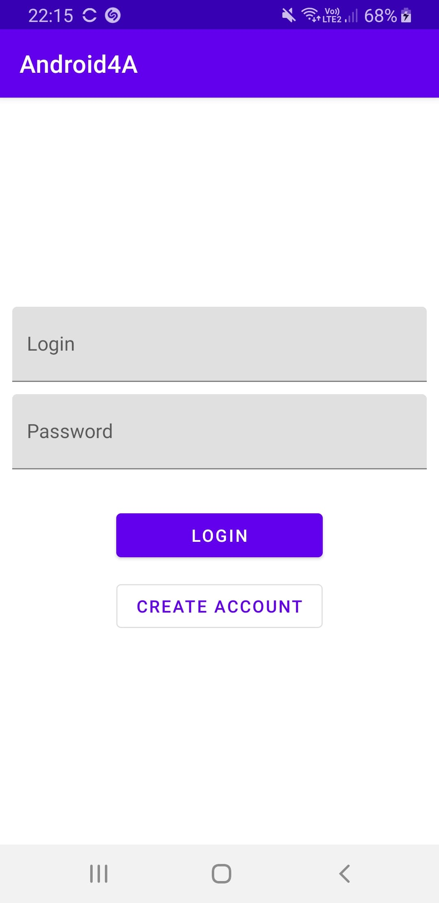
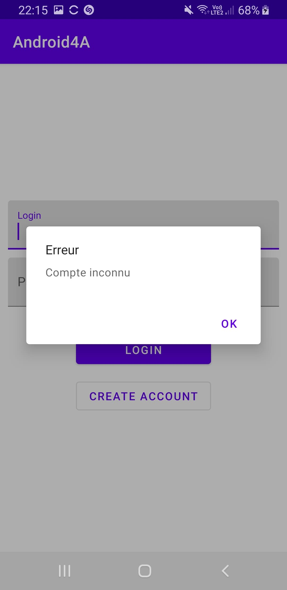
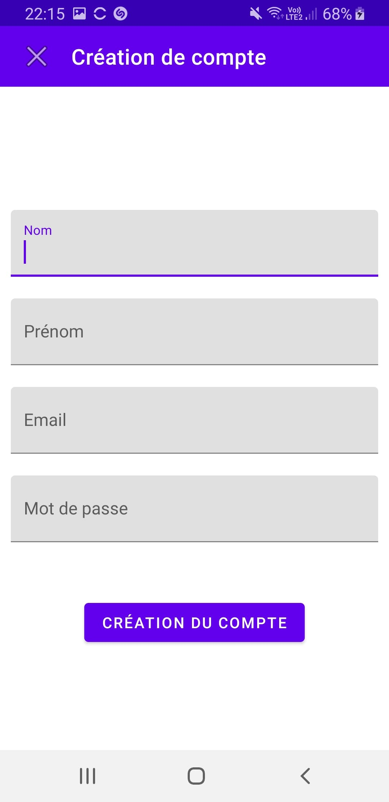
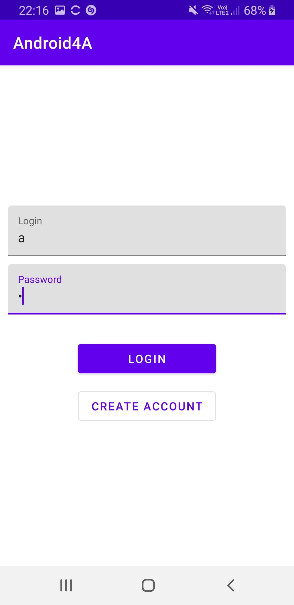
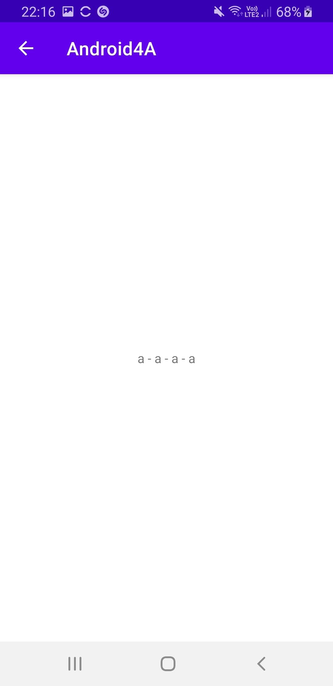

# Programmation Mobile
## Enseignant : Vincent ETIENNE

## Introduction :

Développement d'une application mobile dans le langage de programmation : Kotlin.

## Explication 

### Première page - Accueil 

Nous trouvons ici deux emplacements textuels disponibles. Le premier est le "login" et le second est le "Password". 
Nous avons deux boutons, "LOGIN" et "CREATE ACCOUNT". 
Si on essaye de se connecter avec un compte erroné, on aura un message d'erreur en "pop up" qui s'affichera avec marqué "Erreur Compte inconnu"

 

### Deuxième page - Création 

Affiche les identifiants déjà renseigné dans les champs de l'écran précédent
Demande un E-mail, un mot de passe ainsi qu'un nom et un prénom
Une fois que tout est renseigné il n'y a plus qu'à appuyez sur le bouton création du compte pour créer son compte et revenir sur l'écran de connection.

 

### Troisième page - Connexion

Une fois le compte créé, nous mettons l'identifiant et le mot de passe choisi juste avant dans la page de création. Puis nous cliquons sur "login" et cela nous amène sur la page de fin avec le récapitulatif de nos informations.

  

